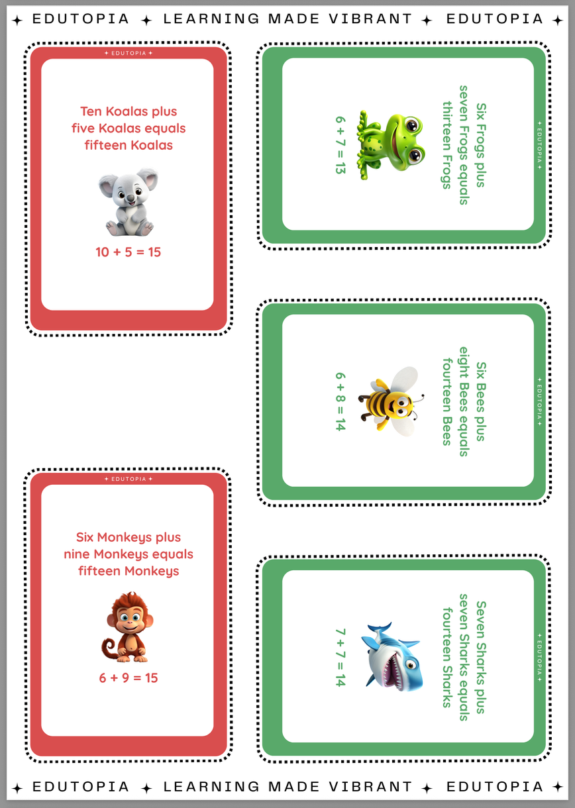

<div align="center">

  # Python Math Flashcard Generator


A fully automated pipeline that generates print-ready, **double-sided** (Front: Question / Back: Answer) A4 PDF math flashcards using custom image assets. Features include automatic **difficulty-based color coding**, asset pluralization via local AI, card compositing, and PDF layout.

<p align="center">
  
  
  
  
</p>

</div>

---

## How to Use

### 1. Preparing Your Assets
To create a new set of flashcards, you need to provide the images.

1.  Navigate to `/input/Assets/`.
2.  Create a new folder with the name of your asset pack (e.g., `Vehicles`, `Toys`, `Mythical Creatures`).
    * *i.e.* **Example:** The project comes with an example folder: `/input/Assets/Animals/`.
3.  Inside your folder, place your image files.
    * **Format:** `.png` (Transparent background recommended).
    * **Dimensions:** 1000x1000px.
    * **Naming:** File names must be the **singular** version of the object (e.g., `Cat.png`, `Lion.png`, `Bird.png`). The script uses AI to figure out the plurals for the cards.

### 2. Configuration (`main.py`)
Open `main.py` and adjust the **MASTER SETTINGS** at the top of the file to customize your run:

| Setting | Description |
| :--- |:---|
| `ASSET_PACK` | The exact name of the folder you created in `/input/Assets/` (e.g., "Animals"). |
| `OPERATION` | Choose between `"Addition"` or `"Subtraction"`. |
| `GENERATE_STANDARD` | `True` / `False`. Generates a "Standard" set where all flash cards are a unified Navy Blue. |
| `GENERATE_COLOR_GRADED`| `True` / `False`. Generates color-coded flash cards by difficulty: **Easy (Blue)**, **Medium (Green)**, **Hard (Red)**. |
| `TARGET_SIZES` | A list of flash card sizes to generate. Options: `["Large", "Medium", "Small"]`. |

### 3. Running the Generator
1.  Ensure you have the requirements installed:
    ```bash
    pip install -r requirements.txt
    ```
2.  **Important:** This project uses **Ollama** to generate text. Ensure Ollama is running and you have the `qwen2.5:14b` model pulled (or update the model name in `operations.py`).
3.  Run the script:
    ```bash
    python main.py
    ```

### 4. Output
Once the script finishes, check the newly created `/Gen/` folder.
* Path: `/Gen/{ASSET_PACK}/Final_PDFs/{OPERATION}/`
* You will find your print-ready PDFs here (e.g., `A4_Large.pdf`).
* The individual flash card images are stored in `/Gen/{ASSET_PACK}/Flash Cards/{OPERATION}`.

---

## Sample Output
The generator creates double-sided PDFs **ready for double sided printing**.

Here is a preview of the medium-sized PDF. Front (Question) and Back (Answer) layouts:

<p align="center">
  
  
</p>

---

## Project Structure

* `main.py`: The pipeline orchestrator.
* `operations.py`: Generates the math problems and uses local AI to create plural text for assets.
* `card_creator.py`: Composites the asset images and text from `operations.py` onto the flashcard templates.
* `pdf_generator.py`: Composites the generated flash card images into A4 layouts and handles double-sided mirroring.
* `pdf_settings.py`: Contains sizing settings and layout coordinates for Large, Medium, and Small PDFs.
