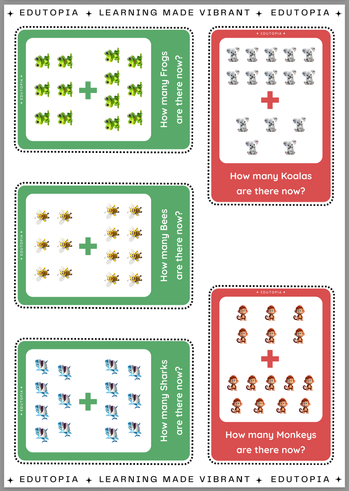
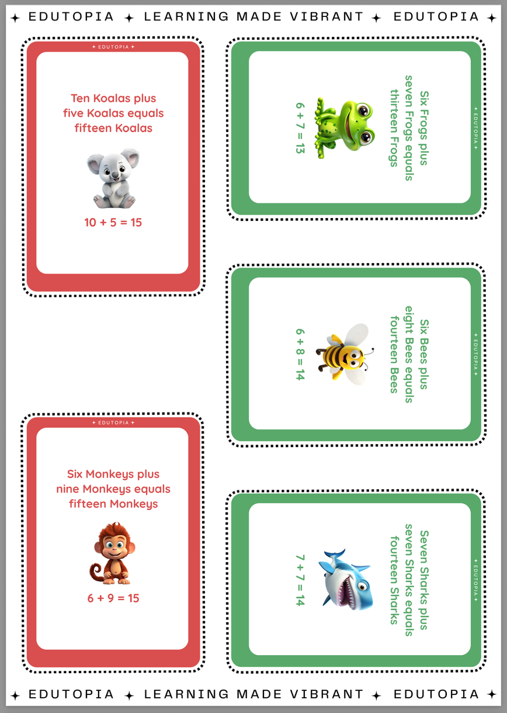

<div align="center">


# Python Math Flashcard Generator

A fully automated pipeline that generates print-ready, **double-sided** (Front: Question / Back: Answer) A4 PDF math flashcards using custom image assets. Features include automatic **difficulty-based color coding**, intelligent asset pluralization, card compositing, and PDF layout. Includes both a **Streamlit web UI** and a CLI.

<p align="center">
  
  
  
  
</p>

</div>

---

## How to Use

### 1. Install Dependencies

```bash
pip install -r requirements.txt
```

### 2. Running the Generator

#### Option A: Web UI (Recommended)

```bash
streamlit run app.py
```

This opens a browser-based interface where you can:

- **Upload your own images** directly to create a custom image pack — no manual file management needed.
- Choose your math operation, card style, and card sizes.
- Watch real-time generation progress.
- **Cancel generation** at any time if you change your mind.
- Preview the generated cards and download the finished PDFs.

#### Option B: CLI

Edit the settings at the top of `main.py`, then run:

```bash
python main.py
```

| Setting | Description |
| :--- |:---|
| `ASSET_PACK` | The exact name of the folder in `/input/Assets/` (e.g., `"Animals"`). |
| `OPERATION` | `Operation.ADDITION` or `Operation.SUBTRACTION`. |
| `STYLES` | List of styles: `[Style.STANDARD, Style.COLOR_GRADED]`. |
| `SIZES` | List of sizes: `[CardSize.LARGE, CardSize.MEDIUM, CardSize.SMALL]`. |

Press `Ctrl+C` to cancel a CLI generation at any time — partial files are cleaned up automatically.

### 3. Preparing Your Own Assets

The web UI lets you upload images directly, but you can also add image packs manually:

1.  Navigate to `/input/Assets/`.
2.  Create a new folder with the name of your asset pack (e.g., `Vehicles`, `Toys`, `Mythical Creatures`).
    * **Example:** The project comes with a sample folder: `/input/Assets/Animals/`.
3.  Inside your folder, place your image files.
    * **Format:** `.png` (transparent background recommended).
    * **Dimensions:** 1000x1000px.
    * **Naming:** File names must be the **singular** version of the object (e.g., `Cat.png`, `Lion.png`, `Bird.png`). Pluralization is handled automatically.

### 4. Output
Once generation finishes, check the `/Gen/` folder.
* Path: `/Gen/{ASSET_PACK}/Final_PDFs/{OPERATION}/`
* You will find your print-ready PDFs here (e.g., `A4_Large.pdf`).
* The individual flash card images are stored in `/Gen/{ASSET_PACK}/Flash Cards/{OPERATION}/`.

---

## Sample Output
The generator creates double-sided PDFs **ready for double sided printing**.

Here is a preview of the medium-sized PDF. Front (Question) and Back (Answer) layouts:

<p align="center">
  
  
</p>

---

## Project Structure

```
├── app.py                  Streamlit web UI
├── main.py                 CLI entry point
├── pipeline/
│   ├── __init__.py         Public API — run_pipeline()
│   ├── config.py           Enums, dataclasses, constants
│   ├── operations.py       Math pair generation + pluralization
│   ├── card_creator.py     Card image compositing (front + back)
│   ├── pdf_generator.py    A4 PDF assembly with double-sided mirroring
│   └── pdf_settings.py     Layout configs (Large / Medium / Small)
├── input/
│   ├── Assets/             Asset packs + font
│   └── templates/          Card and page templates
└── Gen/                    Generated output (gitignored)
```
